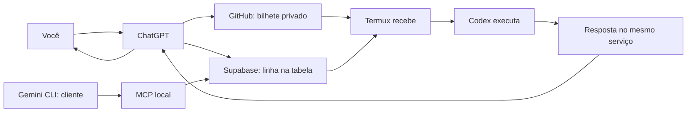

<!-- Gerado por npm run docs:generate; não editar. Fonte: docs/model.json. SHA256: 08b1e874d03bc7e29f3ddddd0df134fd6e2c2ce5ded693e1a5803913bb6669b6 -->
# Ponte remota ChatGPT → Termux → Codex

A ponte entrega seus pedidos ao Codex no Termux e devolve as respostas por GitHub Issues ou Supabase. Pense nela como um serviço de entrega com uma caixa de entrada e um recibo.



## Por onde começar

- [Guia visual para quem está começando](docs/GUIA.md)
- [Apresentação, downloads PDF/PowerPoint e roteiro de áudio](docs/apresentacao/README.md)
- [Apresentação em slides](docs/SLIDES.md)
- [Instalação, operação, segurança e solução de problemas](docs/TECNICO.md)
- [Detalhes do autostart Supabase](autostart/SUPABASE.md)
- [Gemini: enviar e consultar tarefas](integrations/gemini/README.md)
- [Arquitetura multi-IA](docs/MULTI-IA.md)
- [Metadados Multi-IA e estado dos providers](docs/MULTI-IA-METADATA.md)
- [Worker Multi-IA ponta a ponta](docs/MULTI-IA-WORKER.md)
- [Modo híbrido: IA ou comando pronto](docs/EXECUTION-MODES.md)
- [Contrato comum de executores — etapa 01](executors/README.md)
- [START HERE, bootstrap e contrato para Gemini e Claude](docs/integrations/AI-QUEUE-ONBOARDING-PROMPT.md)
- [Números, nomes e estados em português](docs/TASK-IDENTITY.md)
- [Progresso ao vivo e ativação](docs/PROGRESS.md)
- [Dashboard: painel visual, acesso seguro e publicação](docs/DASHBOARD.md)
- [Diagnóstico de permissões Git](docs/GIT-PERMISSIONS.md)
- [Fonte da explicação](docs/model.json)

## Testar sem rede ou credenciais

Pré-requisitos: Node.js 20 ou superior, Python 3.9 ou superior, Bash e flock. Os testes não reinstalam programas, não usam o Codex real e não interrompem workers de produção.

```sh
npm test
npm run docs:generate
npm run docs:check
```

## Abrir o painel de monitoramento

```sh
npm run dashboard:dev
npm run dashboard:build
```

Abra `http://127.0.0.1:4173` para explorar a demonstração. Dados reais exigem login autorizado e a configuração descrita no [guia do dashboard](docs/DASHBOARD.md).

## Verificar os serviços, opcionalmente

Apenas leitura; precisa da autenticação local. Nunca cria tarefas nem executa pedidos. Sem `--allow-network`, o teste recusa acesso à rede.

```sh
npm run smoke:github -- --allow-network
npm run smoke:supabase -- --allow-network
```

## Operar no Termux

```sh
./remote status
python3 autostart/supabase-launcher.py --status
```

Para instalar o autostart Supabase uma vez, na sessão que já possui a credencial exportada:

```sh
python3 autostart/install-supabase-autostart.py
```

Não cole chaves nos comandos, no chat ou no Git. Consulte o anexo técnico antes de iniciar, reiniciar ou recuperar tarefas. GitHub e Supabase têm garantias diferentes: o Supabase atual pode deixar tarefas presas em `running` após uma interrupção.

## Manter a explicação atualizada

Edite `docs/model.json` e, para detalhes avançados, `docs/TECNICO.md`. Rode `npm run docs:generate`, revise o resultado e execute `npm test`. A CI repete essa validação. O gerador não lê credenciais nem a configuração privada da máquina; ele confere o código, a estrutura e os comandos versionados. A revisão humana continua necessária quando muda o significado de um comportamento.
