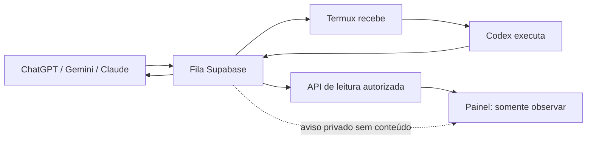

# Painel Codex Bridge

O painel é uma janela para a fila: mostra o que está esperando, o que o Codex está fazendo e o que já terminou. **Não executa comandos, não cancela tarefas e não transforma Gemini ou Claude em executores.**

## Comece pela demonstração

```sh
npm run dashboard:generate
npm run dashboard:dev
```

Abra `http://127.0.0.1:4173`. Os dados fictícios estão identificados como **Demonstração**. Não é necessário configurar Supabase para explorar as telas. Nunca interprete esses números como estado do celular.

- **Visão Geral:** indicadores, execução, atividade e gráficos da fila.
- **Tarefas:** busca por número/nome, filtro de estado, detalhes e paginação.
- **Execução Atual:** metadados e saída recente; pausa de acompanhamento e rolagem automática.
- **Histórico:** tarefas finalizadas agrupadas por data; filtros e busca.
- **Estatísticas:** estados, sucesso, espera, duração, vazão e nomes frequentes.
- **Logs:** escolha de tarefa, linhas numeradas e busca no buffer carregado.
- **Configurações:** limites reais gerados do código, conectividade e restrições.

A identificação normal é **Tarefa 12 — Diagnóstico ADB do BYD — em execução**. Estados internos permanecem `queued/running/succeeded/failed/cancelled`. UUID aparece apenas ao abrir “Identificação técnica”. Tarefas antigas continuam legíveis mesmo sem número/título.

Não há percentual real de execução no contrato atual. A faixa de atividade é indeterminada e não inventa percentuais. Não existe inventário estruturado de arquivos/comandos: essas abas explicam a limitação. O worker também não publica heartbeat: **atividade recente é uma inferência de progresso, não uma confirmação permanente de online**. Ausência de progresso não significa offline.



## Conectar dados reais com segurança

O HTML pode ser público no GitHub Pages; **as tarefas não são públicas**. O modo autenticado só acessa RPCs de leitura após login com uma conta autorizada. O modo público opcional mostra apenas um snapshot de indicadores agregados; veja [experiência executiva e configuração pública](DASHBOARD-EXPERIENCE.md). Não habilite `SELECT` geral para `anon`/`authenticated` em `bridge_tasks` nem publique eventos brutos dessa tabela para o navegador.

1. Um administrador revisa e aplica `database/dashboard-read.sql` no projeto correto. A migração cria funções; não altera os estados, colunas, RLS, grants ou claim da fila. `task-identity.sql` e `task-progress.sql` continuam migrações separadas. Projeção JSON tolera suas colunas ausentes.
2. No Supabase Auth, criar/convidar contas do projeto. A nova política permite os resumos de leitura a contas autenticadas **não anônimas**, sem exigir papel de administrador. **app_metadata** `bridge_dashboard: false` bloqueia explicitamente uma conta; `bridge_dashboard: true` antigo continua compatível. Não usar `user_metadata`. Essa política compartilha os resumos entre contas do projeto: não é segregação por organização/tenant. Instalações existentes devem revisar/aplicar apenas `database/dashboard-authenticated-read.sql` para atualizar a função de autorização; este trabalho não aplicou SQL remoto. Até essa aplicação, a autorização antiga continua valendo.
3. Por padrão os logs não são retornados. Somente após validar a versão/redação do worker em produção, conceder à conta **app_metadata** `bridge_dashboard_logs: true`. Título/progresso também devem conter conteúdo apropriado aos operadores autorizados. Se não for possível verificar a sanitização, **não habilitar logs**.
4. Para avisos ao vivo, revisar/aplicar `database/dashboard-realtime.sql`. Requer `realtime.send` e Realtime habilitado. Auditar políticas existentes em `realtime.messages`: políticas permissivas se combinam com OR, portanto outra política ampla pode tornar a restrição ineficaz. O tópico privado é `bridge-dashboard`.
5. Configurar somente valores públicos no build e abrir “Conectar” no site:

```sh
PUBLIC_SUPABASE_URL=https://pqskisosukkiurddlodw.supabase.co \
PUBLIC_SUPABASE_PUBLISHABLE_KEY=sb_publishable_SUBSTITUA_PELO_VALOR_PUBLICO \
npm run dashboard:build
python3 -m http.server 4173 --bind 127.0.0.1 --directory dashboard/dist
```

O exemplo é um placeholder, não uma credencial válida. O build aceita apenas chave **publishable** moderna, rejeita JWT/`service_role`/`sb_secret_`. Ele não lê a chave privada do worker. Nunca substituir o placeholder por service_role. A chave publicável identifica o projeto, não autoriza a leitura da fila. Não existe variável de senha/token administrativo no frontend.

O login usa a persistência nativa do Supabase Auth (`persistSession: true`, `autoRefreshToken: true`), com sessão no armazenamento do navegador gerenciado pelo SDK. O reload restaura a sessão e verifica o usuário com Auth antes de abrir o painel; cada RPC continua autorizada no backend. A aplicação não cria armazenamento manual de tokens nem persiste senha, tarefas ou logs. “Sair” chama `signOut({scope: "local"})`, encerra Realtime e limpa dados privados da UI; descartar conexão/recarregar não faz logout. Logout em outra aba é observado, e a rotação de token atualiza Realtime. Falha transitória de rede não apaga sessão. Revogação, expiração imposta pelo servidor, remoção do armazenamento ou navegação privada podem exigir login novamente; não se promete sessão eterna. Em aparelho compartilhado, clique Sair ao terminar. Um site estático não dispõe de cookies HttpOnly de backend: preserve CSP, escape de conteúdo, SDK fixado e proteção contra XSS. Use uma senha exclusiva para a conta. O SDK Supabase é carregado de jsDelivr, versão fixa `2.91.0`, somente ao conectar. A demonstração não depende desse CDN. Ambientes que proíbem CDN devem empacotar/auditar o SDK localmente antes de publicar; não remover a autenticação.

### Contrato de leitura

- `bridge_dashboard_list`: no máximo 50 itens por leitura; cursor `(created_at,id)` decrescente. Busca por nome/número e filtro de estado no servidor. Lista não inclui `instruction`, `result`, `error` ou `recent_output`.
- `bridge_dashboard_summary`: metadados de uma única tarefa alterada; evita buscar listas ou logs inteiros a cada aviso.
- `bridge_dashboard_detail`: UUID como parâmetro interno; retorna metadados, resumo genérico de conclusão e, somente com autorização adicional, buffer sanitizado limitado a 500 linhas/512 KiB serializados.
- `bridge_dashboard_stats`: agregados das tarefas **criadas nos últimos 30 dias**, dias em UTC. Taxa de sucesso = sucesso / (sucesso + falha + cancelamento). Durações ignoram timestamps ausentes. Paginação não afeta agregados.
- `task_name` é alias de `task_name` ou `title` quando disponíveis. `task_number` e `progress_seq` são strings decimais na API para preservar precisão de bigint; UUID permanece interno.
- As entradas RPC públicas usam `SECURITY INVOKER`; funções privilegiadas ficam no schema **não exposto** `bridge_dashboard_private` (não adicioná-lo aos schemas da Data API). Essas funções `SECURITY DEFINER` verificam o usuário atual em cada chamada, têm `search_path` vazio, objetos qualificados e `EXECUTE` removido de `PUBLIC`/`anon`. Esse gateway explícito é necessário porque a fila atual não concede leitura aos usuários. Não é uma view pública que contorna RLS silenciosamente.
- Filtro SQL adicional oculta linhas com padrões de credenciais; **não é garantia universal de sanitização de texto arbitrário**. A garantia operacional exige o worker sanitizador validado e contas restritas. Não é oferecido modo público de logs. Resultados/instruções completos devem ser consultados pela integração autorizada existente.

### Realtime e desconexão

Um trigger envia **somente UUID, progress_seq e operação** pelo Broadcast privado; nunca envia linhas brutas da tarefa. O cliente agrupa avisos por até um segundo e relê somente os metadados das tarefas alteradas; detalhes de saída são buscados apenas quando abertos. Agregados são atualizados em lotes de 15 segundos motivados por eventos, sem polling adicional. Eventos com `progress_seq` novo tornam o buffer atualizado visível. Nenhuma tabela de histórico é criada. O transporte interno `realtime.messages` tem retenção própria do Supabase; não é o histórico da aplicação.

Sem conexão Realtime, a leitura de fallback ocorre a cada **60 segundos**. O SDK tenta reconectar; há botões Atualizar e Reconectar. Quando o canal conecta, o timer de fallback é removido. O trigger de aviso não pode impedir claim/finalização: falha de broadcast é isolada. Portanto, a implantação deve testar entrega de eventos; canal conectado sozinho não prova que o trigger está enviando. Se eventos não chegarem, verifique trigger/políticas e use Atualizar ou desabilite o canal até corrigir.

O painel limita a saída novamente no navegador, preserva formatação, escapa texto e nunca tenta recuperar conteúdo já removido pela sanitização. Pausar acompanhamento congela a saída visível; a fila continua trabalhando.

## Publicar no GitHub Pages

`.github/workflows/dashboard-pages.yml` é **manual** (`workflow_dispatch`, branch `main`). Habilitar Pages → GitHub Actions e configurar variáveis do repositório `PUBLIC_SUPABASE_URL` e `PUBLIC_SUPABASE_PUBLISHABLE_KEY`. Ausência de chave produz uma demonstração sem conexão real. Nenhum segredo é necessário no workflow.

Executar o workflow após revisar/commitar os arquivos. Ele roda a suíte offline e o build, publica somente `dashboard/dist`, nunca a raiz do projeto, logs ou configuração privada. Rotas `#overview`, `#tasks` etc. funcionam sob o subdiretório do repositório no Pages. Não foi feito deploy automaticamente pela implementação local.

## Desenvolvimento, testes e atualização

```sh
npm run dashboard:generate  # regenera contrato compartilhado
npm run docs:generate       # atualiza documentação dinâmica
npm run test:dashboard
npm test
npm run dashboard:build
```

Arquitetura: HTML semântico, CSS próprio, módulos JavaScript nativos e gráficos SVG acessíveis. Sem framework, dependência de gráficos ou compilador. `dashboard/shared.mjs` é gerado de `task-display.js` e `task-progress.js`; `npm test` falha se ficar desatualizado. O modelo de documentação acompanha os fontes do dashboard e invalida guia/apresentação quando eles mudam.

Testes offline usam mocks de Auth, RPC e Broadcast, verificam estados, busca, identidade, seq bigint, reconexão, limites, segurança do build e estrutura responsiva. `tests/dashboard-browser.cjs` é smoke real Chromium em desktop/mobile, executado no CI separado com Playwright; não exige Supabase. `tests/test_dashboard_postgres.py` testa os RPCs com PostgreSQL descartável local no CI. Nunca apontar testes para produção. Ver instruções no cabeçalho de cada teste opcional.

Validação adicional portátil, sem navegador e sem servidor PostgreSQL: `tests/dashboard-dom.cjs` executa as quatro telas e a área avançada com LinkeDOM; `tests/dashboard-sql.cjs` executa as migrações e controles de acesso em PostgreSQL/WASM (PGlite) inteiramente em memória. Dependências ficam em diretório temporário, separadas do worker:

```sh
npm install --prefix "$TMPDIR/bridge-dashboard-validation" --ignore-scripts --no-audit --no-fund --package-lock=false @electric-sql/pglite@0.3.14 linkedom@0.18.12
NODE_PATH="$TMPDIR/bridge-dashboard-validation/node_modules" node tests/dashboard-sql.cjs
NODE_PATH="$TMPDIR/bridge-dashboard-validation/node_modules" node --experimental-vm-modules tests/dashboard-dom.cjs
```

O teste de DOM detecta erros de execução e interação, mas não mede layout CSS; essa parte exige o smoke Chromium desktop/mobile do CI.

Para alterar os visuais: `dashboard/styles.css`; telas: `app.mjs`; dados/autenticação: `data.mjs`; regras puras: `core.mjs`; gráficos: `charts.mjs`. A interface atual é deliberadamente apenas leitura.

### Diagnóstico rápido

| Sintoma | Verificação |
|---|---|
| Só aparecem exemplos | Modo Demonstração; configurar chave publicável e login |
| Login aceito, leitura negada | app_metadata confiável e funções da migração |
| Saída indisponível | Colunas de progresso e autorização adicional de logs |
| Dados não mudam | Estado do canal, trigger Broadcast e políticas do tópico |
| Worker não confirmado | Sem heartbeat; conferir processo local sem reiniciá-lo às cegas |
| Tarefa sem número | Aplicar migração de identidade; fallback continua funcionando |
| Contrato gerado desatualizado | `npm run dashboard:generate` e `npm run docs:generate` |

O dashboard não exige reinício do worker. Se as alterações anteriores de progresso/identidade ainda não estiverem carregadas, ativá-las em uma manutenção controlada separada antes de autorizar logs.

Referências: [Broadcast](https://supabase.com/docs/guides/realtime/broadcast), [autorização Realtime](https://supabase.com/docs/guides/realtime/authorization), [funções e SECURITY DEFINER](https://supabase.com/docs/guides/database/functions).

## Revisão dos bloqueios de acesso

- Não havia checagem de papel administrador no frontend. Navegação, tarefas, histórico
  e sistema usam as RPCs; foi removida a exigência de opt-in `bridge_dashboard: true`
  dessas leituras na proposta SQL, mantendo bloqueio explícito `false` e recusando
  contas anônimas. Aplique o SQL incremental antes de considerar isso ativo no remoto.
- Logs não exigem papel admin, mas continuam exigindo `bridge_dashboard_logs: true`
  definido pelo backend e `output_available` retornado pela RPC. A UI nunca força
  essa capacidade. A sanitização em produção precisa ser verificada antes da concessão.
- Nenhum acesso direto à tabela, instruções/resultados completos, segredos ou controle
  de worker foi liberado. Dashboard continua somente leitura e Realtime privado.
- SQL e testes cobrem conta normal, logs negados/liberados, revogação explícita e anon.
  `tests/dashboard-auth.test.cjs` cobre persistência/rotação/logout;
  `tests/dashboard-auth-dom.cjs` cobre login, reload, quatro telas, logs e logout
  com Auth simulado em DOM. Não substitui homologação com conta real autorizada.

### Acompanhar a execução sem gastar tokens

O cartão da tarefa mostra uma estimativa local por etapa, sem chamadas de IA: aguardando 0%, preparando 10%, execução sem etapa específica 25%, testes 65%, commit 80%, publicação 90% e finalização 95%. As etapas são reconhecidas somente na mensagem de progresso já recebida; não são deduzidas do nome da tarefa. O percentual informado explicitamente pelo backend tem prioridade (limitado a 99% durante execução). Apenas sucesso confirma 100%; falha/cancelamento não inventam um percentual. A estimativa pode diminuir quando a tarefa retorna a uma etapa e não representa tempo restante.

A atividade considera o último progresso confirmado (ou início, quando ainda não houve progresso): abaixo de 2 minutos, atividade recente; a partir de 2 minutos, atenção; a partir de 5 minutos, possível travamento. Silêncio não confirma falha: um comando longo pode não produzir saída. Sem conexão ao vivo, mostramos recuperação da conexão, não diagnóstico de travamento. Ícones e texto acompanham as cores. O tempo relativo muda localmente a cada segundo, sem consultas adicionais. Realtime e o fallback existente atualizam os dados; Atualizar continua disponível. A sequência de progresso permanece em detalhes técnicos e nunca calcula porcentagem. Nenhum log adicional é consultado para esta visualização.
