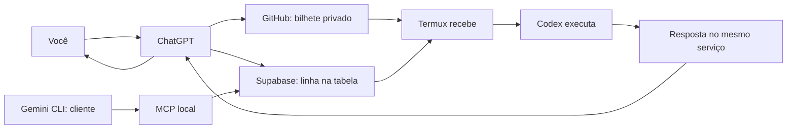

<!-- Gerado por npm run docs:generate; não editar. Fonte: docs/model.json. SHA256: d4209051f9aba451e32228dbaf67615dd49423830c473de737548991f6f29512 -->
# Sua ponte entre ChatGPT e o Termux

## Qual problema resolve?

Você quer pedir algo pelo ChatGPT e receber a resposta do Codex que está no seu Termux. A ponte funciona como um serviço de entrega: leva o pedido, acompanha o trabalho e traz a resposta. O ChatGPT precisa ter uma ferramenta autorizada para enviar e consultar tarefas; uma conversa sem essa conexão não envia tarefas sozinha.

## O caminho do pedido

Você fala com ChatGPT → a tarefa estruturada vai pelo Supabase → o Termux recebe → o executor determinístico executa command ou plan → o resultado volta pela mesma fila → ChatGPT apresenta. O fluxo de produção atual não depende de Qwen, Groq, Antigravity ou outro provider de IA para executar a tarefa. O celular continua sem precisar abrir uma porta para a internet.

## Um exemplo simples

Peça: “Crie a Tarefa 1 — Verificar a ponte, com a instrução: Responda apenas TESTE DA PONTE OK”. O serviço atribui o número real; se já houver tarefas, poderá ser Tarefa 2 ou outro número. O ChatGPT guarda o recibo e consulta essa mesma tarefa. A resposta volta pelos comentários no GitHub ou pela linha no Supabase. Os testes automáticos não enviam esse pedido à produção.

## E o Gemini?

O Gemini CLI pode ser outro balcão de atendimento: com a extensão local configurada, você pede que ele adicione uma tarefa e depois consulte o andamento, a resposta ou o erro. O ChatGPT continua usando a ponte normalmente. Nos dois casos, quem faz o trabalho continua sendo o Codex no Termux; o Gemini ainda não é executor. O resultado aparece após uma consulta, sem promessa de aviso espontâneo. A chave da fila fica com o programa local, não é entregue como ferramenta ou texto ao modelo.

## Como evita pedidos repetidos?

O nome Tarefa 1 — Verificar a ponte ajuda você a acompanhar o pedido. Por trás dele há um identificador técnico permanente, como o código de rastreamento de uma encomenda. No GitHub, a ponte lembra os códigos já atendidos neste Termux. No Supabase, só quem conseguir marcar a linha como em execução pode começar. Criar uma tarefa nova pode executar o pedido novamente; consulte a tarefa anterior antes de repetir.

## Tarefa N — Título

Use nomes como Tarefa 1 — Verificar a ponte e Tarefa 2 — Resumir um arquivo. O número vem do serviço, não precisa ser escolhido por você. No GitHub ele é o número do bilhete; no Supabase será atribuído pelo banco após a atualização planejada. Podem existir saltos na contagem, e cada serviço tem sua própria sequência. Pedidos antigos sem nome aparecem como Tarefa legada — Tarefa sem título até receberem os novos campos.

## Como o celular anuncia o resultado?

Com a voz do Termux disponível, o celular começa dizendo “Tarefa 1 — Verificar a ponte foi finalizada com sucesso.” e depois lê a resposta. Se houver falha, anuncia “foi finalizada com falha” e explica o problema em poucas palavras. Pedidos antigos sem número ou título usam “Tarefa legada — Tarefa sem título”, sem ler o código técnico. A resposta escrita continua igual. Essa fala acontece no celular; não é uma notificação espontânea no ChatGPT.

## Onde ficam as chaves?

As credenciais são como a chave de uma caixa de correio: não devem ir nos pedidos, nas respostas ou no Git. A chave Supabase fica em um arquivo privado fora do projeto. O GitHub usa a autenticação local do programa gh. O pedido é passado como texto ao Codex, sem virar um comando de shell; isso não significa que toda ação pedida ao Codex seja segura ou autorizada.

## Como usar no dia a dia?

Ao abrir uma sessão interativa do Bash no Termux, o launcher do Supabase verifica se já existe um worker. Se existir, preserva-o; caso contrário, inicia um em segundo plano. O supervisor acompanha o worker e tenta reiniciá-lo automaticamente quando ele encerra inesperadamente, com orçamento limitado de tentativas para evitar loop infinito. Para GitHub, use os comandos remote ou o script opcional do Termux:Boot. O celular precisa continuar ligado e permitir execução do Termux em segundo plano.

## Como funciona o commit automático?

O auto-commit Git do worker Supabase é opcional e desligado por padrão. Só ocorre após execução validada, não cria commit vazio, não captura um repositório que já estava sujo e nunca faz git push automaticamente. Pode registrar git_status, commit_sha e git_files.

## Quando algo demora ou falha

Primeiro confira rede, estado do worker e autenticação. Não envie novamente uma ação só porque a resposta demorou. No modo plan, etapas determinísticas podem usar retry limitado, checkpoint, resume e rollback de arquivos alterados; falhas que ultrapassam essa política continuam visíveis para diagnóstico e replanejamento. Um pedido uncertain no GitHub ou running parado no Supabase exige conferir o que ocorreu antes de decidir reenviar.

## Como sabemos que funciona?

A suíte offline verifica respostas, falhas, travas contra duplicação, inicialização automática e o Autopilot determinístico: retry, rollback, checkpoint, resume e bypass de providers. Smoke tests separados validam a integração real quando solicitados explicitamente.

## Como acompanhar enquanto trabalha?

Com a atualização de progresso instalada, a tarefa mostra uma frase da etapa e até 500 linhas recentes, limitadas também por tamanho e filtradas para não publicar segredos conhecidos. A ponte envia em lotes: a cada 30 linhas novas ou 60 segundos desde o último envio confirmado, e também ao terminar um comando com saída pendente. Comandos sem saída pendente não geram atualização extra. Cada envio confirmado recebe um contador e informa motivo e quantidade de linhas novas; aplicativos podem comparar o contador para perceber novidades. Isso não envia mensagens automaticamente ao ChatGPT. O resultado final continua no mesmo lugar. Os campos do banco ainda exigem a migração documentada; a instalação antiga continua funcionando sem eles.

## O estado em português

Você acompanha frases como “Tarefa 12 — Diagnóstico ADB do BYD — em execução”. Os estados aparecem como na fila, em execução, concluída, falhou ou cancelada. Por dentro, a fila mantém os mesmos códigos em inglês. A palavra cancelada apenas apresenta um estado recebido; não significa que exista uma ferramenta de cancelamento. O nome fica em title, também apresentado como task_name pela integração.

## Esta explicação acompanha o projeto

O texto e os slides vêm da mesma fonte versionada, docs/model.json. O gerador confere arquivos, contratos e comandos reais e calcula uma assinatura do código relevante. Se esses arquivos mudarem e a documentação não for atualizada, npm test falha. Mudanças de comportamento ainda precisam de revisão humana: a assinatura detecta mudanças, mas não entende sozinha todo o significado do código.

## Quando não precisa de IA

O padrão de produção atual é determinístico: tarefas operacionais usam command ou plan no próprio Termux, sem chamar Codex, Groq, Qwen ou Antigravity. O modo agent permanece no código apenas para compatibilidade e testes, mas o launcher de produção o bloqueia. O modo plan executa uma sequência estruturada, com retry limitado, checkpoint, resume e rollback; texto solto nunca vira comando automático.

## Duas caixas de entrada

### GitHub Issues

Uma tarefa vira um bilhete em uma caixa de entrada privada do GitHub. O Termux lê esse bilhete e escreve a resposta nos comentários.

Se houver dúvida após uma interrupção, o bilhete fica como uncertain (resultado incerto), sem repetir a ação automaticamente.

### Supabase

Uma tarefa vira uma linha na tabela bridge_tasks, como uma linha de uma planilha. O Termux marca que está trabalhando e preenche a resposta na mesma linha.

Uma interrupção pode deixar a linha em running (em execução). Resultados já concluídos são preservados em recibos privados para republicação; a tarefa não é executada novamente automaticamente.

## Próximos passos

- [Painel visual da fila](DASHBOARD.md)
- [Comandos e índice](../README.md)
- [Apresentação](SLIDES.md)
- [Anexo técnico e instalação](TECNICO.md)
- [START HERE, bootstrap e contrato para Gemini e Claude](integrations/AI-QUEUE-ONBOARDING-PROMPT.md)
