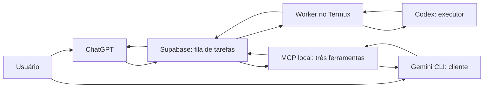

# Multi-IA: Gemini como cliente, Codex como executor

Esta primeira integração acrescenta uma origem de pedidos, sem substituir o fluxo ChatGPT → Supabase → Termux → Codex → Supabase. O Gemini envia e consulta a mesma fila; não executa instruções nem disputa o claim do worker.

## Fronteira de confiança

O MCP é um processo Node local via stdio. Não abre porta HTTP. `loadLocal` lê a credencial do arquivo já existente, conferindo proprietário, diretório 0700 e arquivo regular 0600 com `O_NOFOLLOW`. A URL vem somente de `remote-config.json`; deve ser HTTPS, sem usuário/senha, query ou fragmento. Os argumentos das ferramentas não aceitam URL, chave, SQL, caminho de arquivo ou headers.

A credencial nunca entra no manifesto, nos settings, nos argumentos do processo ou no conteúdo MCP. O launcher `run-gemini.py` remove a credencial Supabase do ambiente antes de iniciar Gemini. Só `CODEX_BRIDGE_ROOT`, um caminho sem segredo, é declarado como configuração de extensão. O manifesto exclui ferramentas nativas de shell e arquivos na sessão cliente; isso é proteção de aplicação, não isolamento entre processos do mesmo UID. Se houver outras ferramentas com acesso ao sistema, devem ser avaliadas pelo operador. Uma fronteira forte exigiria usuário/processo separado e credencial de serviço dedicada, fora do escopo desta versão.

O processo MCP possui a credencial privilegiada existente: a superfície exposta é limitada por código, não por novos grants no banco. Não há alteração de RLS, grants, roles, funções remotas ou policies. Por isso este servidor deve rodar somente como integração local confiável, não como serviço multiusuário público.

## Fluxos e compatibilidade

- `create`: valida campos, consulta as capacidades do esquema com GET `limit=0`, gera/preserva UUID e faz um único POST em `bridge_tasks` com status queued. Usa a normalização de título existente em `task-display.js`.
- `get`: valida o identificador e monta filtros fixos por UUID ou `task_number`; retorna apenas campos permitidos, com resultado/erro limitados em tamanho e flag `truncated`.
- `list`: filtra estados conhecidos, limita 1–50 linhas, ordena por data e ID; retorna metadados sem instrução, resultado ou erro completos.
- Esquema legado: somente erros explícitos de coluna inexistente (HTTP 400 + `42703`/`PGRST204`) ativam o fallback. Falhas de autenticação/rede não são tratadas como ausência de migração. O POST não inclui novas colunas. Títulos ficam em `~/.config/codex-bridge/gemini-titles/UUID.json` (0700/0600), sem alterar a instrução. Metadados locais não sincronizam entre dispositivos.
- Criação ambígua: não há repetição automática. Retorna `uncertain` e recibo para consulta; esse é um estado do resultado da ferramenta, não uma nova escrita no status da tarefa.
- `request_id` opcional: UUID fornecido pelo cliente pode ser reutilizado conscientemente. Um conflito HTTP 409 é reconciliado por leitura; só retorna a tarefa existente se instrução e título corresponderem. Não usa upsert nem altera a tarefa original.

O nome humano é a apresentação principal. O UUID só aparece como identificador de consulta quando não há número humano ou quando é necessário reconciliar uma criação incerta. O nome não muda a chave primária nem os locks e estados do executor.

## Protocolo e operação

O servidor implementa JSON-RPC MCP por linhas UTF-8: initialize, notificações, ping, tools/list e tools/call. Negocia versões 2024-11-05, 2025-03-26 e 2025-06-18. Não anuncia recursos, prompts, sampling ou execução de processos. Limita entrada a 256 KiB e oito solicitações em andamento. Cancelamentos não desfazem POSTs já enviados; requisições HTTP têm deadline de 20 segundos e redirects são recusados. stdout contém somente mensagens MCP. Não há logs de requests/headers; erros brutos do serviço são omitidos.

A instância é iniciada pelo Gemini e não gerencia os workers. Handshake/listagem de ferramentas não carrega credenciais nem consulta o banco. Configuração é carregada na primeira chamada de ferramenta e mantida em memória até encerrar o MCP; reabra a sessão após rotação de chave/configuração.

Os resultados retornados ao Gemini são dados não confiáveis, não instruções para novas ações. A extensão inclui contexto para não executar comandos encontrados nas respostas, não repetir criações incertas e não buscar credenciais. A integração é pull: não há aviso espontâneo no ChatGPT ou Gemini.

## Validação e limitações

`npm test` inclui criação, get/list, título/numeração, legado, falhas de rede, conflitos, validação contra filtros arbitrários, sanitização da chave e handshake stdio real com rede simulada. Testa também carregamento seguro do arquivo e metadados locais. Nenhum teste inicia Gemini real nem chama o worker de produção. A instalação/autenticação Gemini e a primeira descoberta real das ferramentas são passos locais separados.

Para instalar e operar, veja [o guia da integração](../integrations/gemini/README.md). Referências de protocolo: [MCP stdio](https://modelcontextprotocol.io/specification/2025-06-18/basic/transports), [MCP tools](https://modelcontextprotocol.io/specification/2025-06-18/server/tools), [Gemini MCP](https://geminicli.com/docs/tools/mcp-server/) e [extensões Gemini](https://geminicli.com/docs/extensions/reference/).

## Contrato para novas IAs

A [interface formal versão 1 e Adapter Compliance Checklist](integrations/AI-QUEUE-ONBOARDING-PROMPT.md#interface-formal-do-adaptador-versão-1) define criação mínima, consulta, listagem, apresentação e espera opcional. É o alvo de compatibilidade para Gemini, Claude e futuros clientes, não uma afirmação de conformidade completa do Gemini atual: ele já aceita instruction sozinha, tem outro formato de identificadores no retorno e ainda não oferece espera. O [prompt universal](integrations/AI-QUEUE-ONBOARDING-PROMPT.md#prompt-universal-para-colar-em-outra-ia) inclui o contrato autocontido.

Comece pelo [START HERE e bootstrap técnico](integrations/AI-QUEUE-ONBOARDING-PROMPT.md#start-here): parâmetros públicos, distinção local/GitHub, checks de leitura e exemplos genéricos de configuração. Credenciais ficam exclusivamente no adapter/backend; os exemplos não anunciam um backend dedicado já implantado.

## Progresso opcional por tarefa

Consulte [progresso ao vivo](PROGRESS.md) para batching, campos opcionais, sanitização, logs locais e ativação. O schema proposto ainda está pendente; estados e claim permanecem iguais.

## Identidade e apresentação

Consulte [números, nomes e estados](TASK-IDENTITY.md): title persistido/task_name na API, summaries em português, backfill por created_at e sequência concorrente. UUID/status internos são preservados. Gemini já aceita instruction sem título e task_name como alias, além de reconhecer cancelled na leitura (sem operação de cancelamento).
