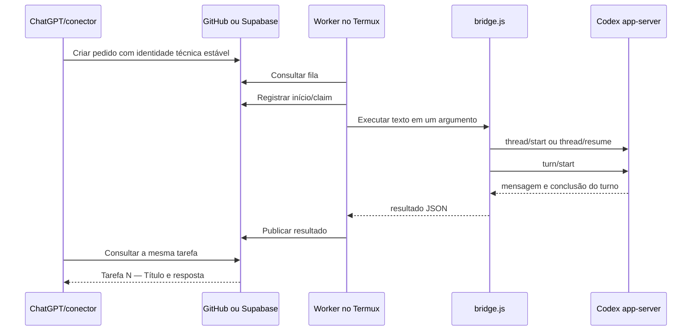
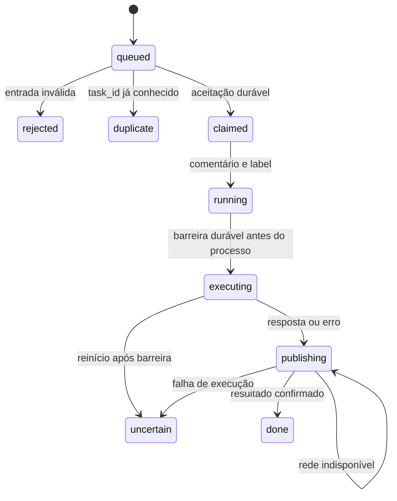
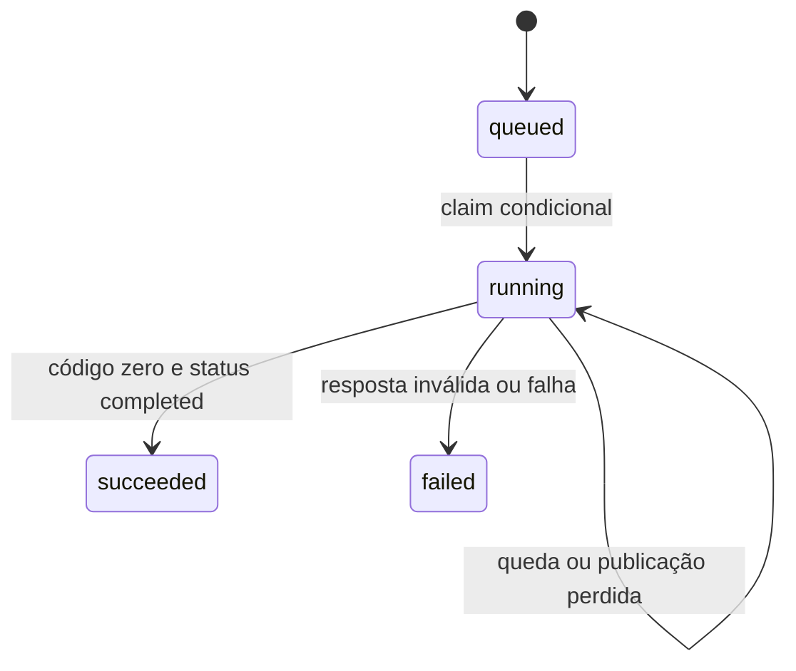

# Anexo técnico: arquitetura, instalação e manutenção

Comece pelo [guia visual](GUIA.md). Este anexo descreve as garantias reais do código, incluindo limites que não devem ser confundidos com sucesso.

## Componentes e isolamento

| Componente | Responsabilidade |
| --- | --- |
| `bridge.js` | Serializa a thread via `flock`, conversa com app-server em loopback e devolve JSON quando `CODEX_BRIDGE_JSON=1` |
| `remote` / `remote-worker.js` | GitHub Issues, autenticação `gh`, journal em disco e publicação reconciliada |
| `supabase-worker.js` | GET de tarefas, claim condicional por PATCH e retorno à mesma linha |
| `worker.js` | Fila local legada `inbox`/`outbox`; independente dos transportes remotos |
| `autostart/supabase-launcher.py` | Detecta processo existente; trava durante execução; destaca novo worker com logs filtrados |
| `task-display.js` | Normaliza título e mostra `Tarefa N — Título`, sem usar UUID como nome humano |
| `scripts/tasks.cjs` | Cliente explícito de criação e consulta dos dois transportes; nunca faz retry automático de criação |

Threads locais, GitHub e Supabase usam arquivos distintos. A trava da thread evita chamadas simultâneas na mesma conversa, mas não transforma as ações do Codex em uma transação. Não altere arquivos de estado para forçar repetição.



## Timeout prioritário

`CODEX_BRIDGE_TIMEOUT_MS` controla o prazo do diálogo com app-server. Padrão: **900000 ms (15 minutos)**. Aceita inteiro decimal de 1 a 2147483647 ms. Ausente, inválido, zero, negativo, fracionário ou acima do limite usa o padrão seguro. Exemplo de configuração sem credenciais:

```sh
export CODEX_BRIDGE_TIMEOUT_MS=1200000
```

É herdado pelas novas chamadas. Não altera timers de processos já carregados. Ao terminar, o timer principal é cancelado; o timer de encerramento WebSocket também é limpo quando a conexão fecha. A mensagem de timeout informa o prazo usado e avisa que o turno pode continuar: não reenviar automaticamente. O prazo começa após a verificação de disponibilidade do app-server, e não inclui espera pelo lock. Chamadas `gh` do worker têm prazo separado de 30 segundos, com SIGTERM; um processo que ignore esse sinal não tem escalonamento para SIGKILL. O `fetch` do worker Supabase atual não tem deadline próprio. O cliente opcional e os smoke tests têm prazo de 20 segundos.

## GitHub: contrato e recuperação

Use repositório privado com Issues habilitadas e autores autorizados em `remote-config.json`. Só issues abertas com `codex:queued` são coletadas; pull requests e autores não autorizados são ignorados. O corpo é JSON, sem cercas Markdown:

```json
{
  "protocol": "codex-bridge/v1",
  "task_id": "12345678-1234-1234-1234-123456789abc",
  "title": "Verificar a ponte",
  "prompt": "Responda apenas: TESTE DA PONTE OK"
}
```

`title` é opcional; usa título da issue quando ausente, ou `Tarefa sem título`. O protocolo anterior segue aceito. `task_id` continua a chave de idempotência (8–100 caracteres alfanuméricos, ponto, hífen, underscore). O prompt não pode ser vazio, conter NUL ou exceder `maxPromptBytes`. A apresentação usa o número nativo da issue, que pode ter lacunas e compartilha sequência com pull requests. Não é uma sequência global entre transportes.



Estados internos `claimed`, `executing`, `publishing` diferem das labels. `done` equivale a sucesso; `uncertain` significa resultado possivelmente iniciado, sem reexecução automática. `error` é reservado/manual. `duplicate` e `rejected` não executam. O journal usa arquivo temporário, fsync e rename. Comentários têm marcadores determinísticos; resposta HTTP perdida após publicação é reconciliada antes de repetir. Resultados são particionados em blocos de até 16000 caracteres. Label não relacionada é preservada. O lock é local, não uma eleição distribuída: não opere a mesma fila em vários dispositivos.

## Supabase: contrato e limites

A tabela existente usa `id` UUID, `instruction`, `status`, `created_at`, `claimed_at`, `updated_at`, `completed_at`, `result`, `error`. O worker usa a URL em `remote-config.json` (`supabase.url`) ou `CODEX_SUPABASE_URL`. A chave fica no ambiente do processo; o launcher carrega o arquivo privado. Não é uma credencial para frontend.

O GET seleciona a linha queued mais antiga. `select=*` permite ler metadados adicionais sem exigir novas colunas antes da migração. Não registramos a linha completa em logs. O PATCH de claim inclui `id=eq.UUID&status=eq.queued`, solicita a linha resultante e só executa quando recebe uma linha. Essa atualização condicional impede dois workers de reclamar a mesma linha simultaneamente. Uma criação diferente, com outro UUID, é outra tarefa.



O worker não valida a instrução com o mesmo esquema do GitHub, não tem outbox durável nem mecanismo de lease/recuperação de `running`. `supabase-state` existe, mas não guarda journal de resultados. Erros de publicação podem deixar a tarefa em `running`; restart não a repete. `uncertain`/`duplicate` não são estados implementados desse transporte. Os testes tornam esses limites explícitos, sem alegar garantias ausentes.

## Identificação humana e migração proposta

`database/task-identity.sql` é uma proposta executável, **não aplicada automaticamente**. Requer revisão do esquema e permissões existentes e validação em staging. Não existe CLI Supabase instalada neste ambiente; por isso o arquivo está em `database/`, fora de um histórico de migrations inventado. Quando a CLI estiver disponível, crie a migration com `supabase migration new task_human_identity` e copie o SQL revisado para o arquivo gerado.

- Mantém `id` UUID e os estados existentes.
- Acrescenta `task_number bigint GENERATED ALWAYS AS IDENTITY` e índice único. Números são atribuídos no banco, inclusive sob concorrência; clientes não enviam números.
- Registros antigos recebem números na adição da coluna; a ordem histórica de atribuição não promete ordenar por `created_at`. A reexecução da proposta preserva números existentes e recusa coluna conflitante.
- Acrescenta `title` com padrão `Tarefa sem título`, espaços normalizados e limite de 80 caracteres. Não deriva títulos da instrução, que pode conter dados privados.
- Trigger impede renumeração e mantém normalização. Usa `SECURITY INVOKER`, `search_path` fechado e revoga execução pública da função; não amplia grants nem desativa RLS.
- A transação exige lock exclusivo com espera máxima de 2 segundos e statement timeout de 30 segundos. Pode bloquear escrita brevemente: aplicar em janela planejada, nunca como parte de testes de produção. Para tabela grande, planejar backfill em fases.
- Sequências podem ter lacunas por rollback e não representam ordem de conclusão. Não reutilizar números nem usar `max()+1`.

Antes de aplicar: confira PK, tipos, índices, RLS, políticas, grants e dependências, faça backup e rode `npm run test:postgres` em banco local descartável. Após aplicar: confira unicidade, inserts antigos sem título/número, operações do papel autorizado e advisors. A migração não concede novos acessos. Rollback operacional preferido: voltar o código, mantendo as colunas aditivas; não apagar os números já divulgados.

Referências: [sequências PostgreSQL e concorrência](https://www.postgresql.org/docs/current/functions-sequence.html), [tabelas Supabase](https://supabase.com/docs/guides/database/tables). O worker antigo continua funcionando com as colunas novas; o novo worker funciona sem elas e exibe `Tarefa legada — Tarefa sem título` quando necessário. Números acima do limite seguro do JavaScript devem ser recebidos como string pelo cliente; números arredondados não são apresentados como válidos.

## Criar e consultar com o cliente opcional

A criação é uma ação real, separada dos testes. O exemplo a seguir só prepara a entrada; nenhum teste offline chama `create` contra serviços reais. Mantenha o mesmo UUID técnico em caso de resposta ambígua e consulte antes de reenviar.

```sh
# Criação explícita: a instrução JSON vem pela entrada padrão, não por shell expansion.
printf '%s\n' '{"id":"12345678-1234-1234-1234-123456789abc","title":"Verificar a ponte","instruction":"Responda apenas: TESTE DA PONTE OK"}' | npm run tasks -- supabase create
npm run tasks -- supabase get 1  # após migração, pelo número humano
npm run tasks -- supabase get 12345678-1234-1234-1234-123456789abc
npm run tasks -- github get 1
```

No GitHub, `create` aceita `task_id` e `prompt` (também aceita os aliases `id` e `instruction`). O título aparece na issue e no protocolo. `get` consulta os comentários de resultado do autor permitido, ordena as partes e devolve resposta e nome humano. No Supabase, a criação com título requer a migração aplicada; integrações antigas que enviam só os campos anteriores continuam válidas. POST não faz fallback ou retry automático, evitando duplicação após resposta perdida. Um recibo técnico é emitido antes do POST para permitir reconciliação. A saída de consulta contém o resultado solicitado: não a publique automaticamente em logs compartilhados.

## Instalação e operação

Pré-requisitos: Termux com Node, Python, Bash, flock; Codex já configurado; `ws` instalado conforme lockfile. Não reinstale a instalação funcional para rodar testes. Para uma instalação nova, `npm ci` instala dependências, mas não autentica serviços. Copie a configuração de exemplo documentada abaixo para `remote-config.json`, usando seus valores localmente, e não inclua segredos nesse JSON:

```json
{"repository":"owner/private-queue","allowedAuthors":["owner"],"pollSeconds":15,"maxPromptBytes":24000,"supabase":{"url":"https://example.invalid","pollSeconds":15}}
```

GitHub usa login `gh` já provisionado; faça autenticação local, nunca no chat. Para Supabase, execute `python3 autostart/install-supabase-autostart.py` na sessão que já possui a variável exportada. Sem a variável, ele recusa a instalação. O arquivo `~/.config/codex-bridge/supabase-service-role.key` fica 0600, diretório 0700. Chave existente diferente é preservada. `.bashrc` recebe um bloco marcado só em shell interativo; antes de modificar arquivo existente, o instalador salva backup privado. Nenhum segredo aparece no bloco.

```sh
./remote status
./remote start
python3 autostart/supabase-launcher.py --status
python3 autostart/supabase-launcher.py
```

`remote stop/restart` são comandos operacionais, não diagnóstico: podem afetar trabalho em curso. Não são executados contra produção na suíte. Autostart GitHub usa `autostart/20-codex-bridge` via Termux:Boot, com espera e wake-lock; requer instalação/ativação do app e permissões de bateria do Android. Autostart Supabase acontece ao abrir Bash; não é watchdog contínuo nem garantia contra encerramento pelo Android.

## Segurança e logs

O conteúdo da tarefa vai como um argumento literal para `spawn`, sem `shell:true`, eval ou sh -c. Isso impede injeção no transporte, mas o Codex pode executar ações pedidas conforme suas próprias permissões. Pedidos de aprovação interativa retornam erro; não são aprovados silenciosamente. Preserve as políticas existentes do app-server. A suíte usa fixtures e não altera permissões do Codex.

Logs Supabase gerenciados pelo launcher são 0600 em diretório 0700, rotação de 1 MiB e três backups, apenas eventos conhecidos. O worker iniciado diretamente pode registrar mensagens de erro de transporte; prefira o launcher. O GitHub guarda stdout/stderr e resultados no journal privado; são dados potencialmente sensíveis, não material de commit. Títulos devem ser descrições curtas sem segredos. Nenhum teste usa a credencial de produção: o runner cria HOME temporário e remove o ambiente herdado, salvo variáveis básicas de execução.

## Troubleshooting

| Sintoma | Verificação e próximo passo |
| --- | --- |
| Tarefa não inicia | Worker ativo? GitHub privado/Issues habilitadas/autor permitido/label queued? Supabase status queued? |
| Falha de autenticação | Execute smoke somente leitura; verifique autenticação local sem imprimir chave |
| Timeout | Consulte o estado existente; o turno pode continuar. Ajuste `CODEX_BRIDGE_TIMEOUT_MS` para futuras chamadas |
| GitHub uncertain | Inspecione journal e turno local; não apague a barreira para reenviar |
| Supabase running parado | Compare estado remoto e execução local; nenhuma recuperação automática é implementada |
| Autostart não funciona | Bash interativo, sintaxe de `.bashrc`, permissões 0700/0600 e configuração URL |
| Tarefa legada | Campos humanos ainda não disponíveis; não significa erro de execução |
| docs:check falha | Revise modelo/contratos e rode docs:generate; não remova a validação |

## Testes e CI

`npm test` roda, sem rede e sem segredos:

1. Validação de documentação gerada e contratos com o código.
2. Node test runner: unidades e integração simulada dos transportes, RPC/WebSocket, timeout, resultados, identidade humana e fila local.
3. Integração GitHub com executáveis falsos, arquivos e flock reais em diretório temporário: resposta perdida, deduplicação, restart e recuperação uncertain.
4. Integração do instalador/launcher com HOME fictício, chave sintética e worker inofensivo: concorrência, permissões, logs filtrados, symlinks, backup e Bash interativo.
5. Testes de obsolescência da documentação, contratos SQL e smoke tests com rede simulada.

O harness VM executa o código-fonte real com processo, rede e timers substituídos, remove somente a chamada automática de entrada Supabase e permite exercitar funções internas. Não conecta ao app-server real. Timers são avançados manualmente, sem aguardar 15 minutos. Esses testes não provam comportamento do Android, entrega do boot, permissões reais do banco ou execução de uma tarefa real pelo Codex.

`npm run smoke:github -- --allow-network` e `npm run smoke:supabase -- --allow-network` só fazem GET; não criam tarefas, não imprimem registros e não substituem um teste ponta a ponta. Não fazem parte de `npm test`.

`npm run test:postgres` é separado: exige psql, `PGHOST=127.0.0.1` ou localhost, `PGDATABASE=bridge_test` descartável e credenciais locais via ambiente. Cria apenas um esquema aleatório, aplica o SQL nele, testa backfill e 16 inserts concorrentes e remove esse esquema. Nunca apontar para banco de produção. A CI provisiona PostgreSQL isolado para esse job; a suíte offline não exige banco. Se PostgreSQL não estiver instalado localmente, esse teste não foi executado localmente e deve ser conferido na CI/staging.

## Documentação dinâmica

`docs/model.json` é a fonte editorial versionada; `scripts/generate-docs.py` valida trechos dos contratos, inventário de arquivos e scripts npm, e gera README, guia, slides, catálogo de downloads e roteiro de áudio determinísticos. Não lê `remote-config.json`, variáveis ou credenciais. Mudanças relevantes no código/modelo alteram uma assinatura nos cinco documentos. A CI e `npm test` recusam divergências. A assinatura detecta edição, não substitui revisão semântica: quem muda uma regra precisa atualizar sua explicação e seus testes.


## Apresentação, downloads e áudio

A área `docs/apresentacao/README.md` é gerada pelo mesmo comando de documentação. O campo `presentation` de `docs/model.json` contém o roteiro e o catálogo de arquivos. `scripts/presentation-docs.py` verifica presença e formato básico de PDF, PPTX e MP3; arquivos ausentes aparecem como pendentes, sem links quebrados. Arquivos presentes entram na assinatura por hash e tamanho. Os testes recusam catálogo ou roteiro desatualizados e binários com formato não reconhecido.

A fonte para exportar a apresentação é `docs/SLIDES.md`; PDF e PowerPoint precisam ser exportados e revisados em um editor apropriado, incluindo a renderização dos diagramas. O áudio precisa ser gravado a partir do roteiro em português e salvo como `docs/apresentacao/explicacao-projeto.mp3`. Nenhum arquivo binário é simulado ou sintetizado pelo gerador. A validação não comprova fidelidade visual ou semântica dos binários: depois de editar a fonte, reexporte os arquivos afetados. Rode `npm run docs:generate` e `npm test` antes de publicar.

Esta área não modifica a visibilidade do repositório. Enquanto a fila estiver em um repositório privado, os downloads também exigem acesso autorizado. A divulgação aberta deve usar apenas materiais revisados e um canal autorizado, sem expor tarefas ou configurações privadas. A meta é o retorno automático ao ChatGPT; o comportamento atual depende de consulta pela integração, sem promessa de notificação espontânea.


## Anúncio real por voz no Termux

`task-tts.js` produz e envia o anúncio pela entrada padrão de `termux-tts-speak -l pt -n BR`, com `shell:false`. O cabeçalho e o corpo seguem juntos, nessa ordem:

- Sucesso: `Tarefa 7 — Revisar testes foi finalizada com sucesso.` seguido da resposta existente, limpa de marcação para leitura.
- Falha: `Tarefa 7 — Revisar testes foi finalizada com falha.` seguido de um resumo seguro; timeout avisa que o trabalho pode continuar e que não se deve reenviar sem conferir.
- Legado: `Tarefa legada — Tarefa sem título ...`; nunca deriva nome da instrução nem usa UUID como número. Se houver título, ele é preservado mesmo sem número.

Os workers passam apenas os metadados humanos por `CODEX_BRIDGE_TASK_TRANSPORT`, `CODEX_BRIDGE_TASK_NUMBER` e `CODEX_BRIDGE_TASK_TITLE`. GitHub usa o número da issue; Supabase usa os campos da linha retornada pelo claim. O UUID continua no protocolo/journal, mas é removido do texto falado, inclusive quando aparece na resposta ou no título. Credenciais conhecidas do ambiente são removidas antes da limpeza de Markdown; o processo de voz recebe somente variáveis básicas do ambiente, sem a chave Supabase. Corpos de erro arbitrários não são narrados. Nenhum filtro substitui a revisão de respostas que possam conter outros dados pessoais.

A ponte ativa esse caminho em modo JSON (usado pelos workers), ou quando `CODEX_BRIDGE_TTS=1`. `CODEX_BRIDGE_TTS=0` desativa esse caminho e mantém o notify global existente. Isso não é um silenciador global: o hook do usuário pode continuar falando. Chamadas locais não JSON conservam o comportamento anterior. O resultado JSON, o campo `answer`, o `result` Supabase e os comentários GitHub não são prefixados nem substituídos por texto de voz.

Para evitar que a notificação global leia primeiro uma resposta sem identificação, a ponte envia `config: {notify: []}` em `thread/start` e `thread/resume` quando controla a voz. O schema gerado pela instalação local aceita `config` em ambos; a [referência de app-server](https://learn.chatgpt.com/docs/app-server) documenta overrides ao iniciar/retomar, e a [referência de configuração](https://learn.chatgpt.com/docs/config-file/config-reference) descreve `notify`. Não modifica `~/.codex/config.toml` nem `~/.codex/falar.py`. Conversas já em andamento não são interrompidas para aplicar a mudança. A efetividade acústica e a ausência de duplicação com versões específicas do app-server ainda precisam de observação no aparelho; os testes validam as requisições, o prefixo e os bytes enviados ao processo TTS, sem executar turnos reais.

A fala é best-effort: serviço ausente, erro ou prazo de 120 segundos não muda o resultado da tarefa. Ao exceder o prazo, somente o processo de voz criado pela ponte é encerrado. O timer é limpo ao sair; o processo da ponte pode aguardar a fala por até esse prazo antes de encerrar, e a gravação do resultado pelo worker ocorre após isso. A chamada ao TTS não confirma que o usuário ouviu o áudio.

Testes: sucesso, falha, legado, título/UUID, remoção da credencial sintética, propagação dos metadados pelos workers, stdin real de um receptor falso, indisponibilidade do serviço, timeout de voz, preservação do JSON e override de notify em start/resume. Nenhum teste toca no alto-falante ou no worker de produção. Novas chamadas da ponte leem o código atualizado; workers já carregados só passarão os novos metadados quando forem recarregados normalmente, usando o fallback até lá.


## Cliente Gemini e arquitetura multi-IA

`integrations/gemini/` acrescenta um servidor MCP local com três ferramentas de criação/consulta/listagem. Ele reutiliza a fila Supabase e a apresentação humana, mas não executa a tarefa, não faz claim e não altera os workers. O fluxo ChatGPT existente permanece disponível. A autenticação fica no processo local, sem chave nos settings/manifesto nem nas respostas ao Gemini. Não há mudança de RLS ou grants.

Veja [a instalação para leigos](../integrations/gemini/README.md) e [a arquitetura e os limites de segurança](MULTI-IA.md). O launcher do Gemini remove credenciais Supabase herdadas e a extensão exclui ferramentas nativas de shell/arquivos na sessão cliente; isso não é um isolamento forte entre processos do mesmo usuário. A execução real pelo Gemini não é parte desta versão, assim como notificações espontâneas não estão implementadas.

## Progresso opcional por tarefa

Consulte [progresso ao vivo](PROGRESS.md) para batching, campos opcionais, sanitização, logs locais e ativação. O schema proposto ainda está pendente; estados e claim permanecem iguais.

## Identidade e apresentação

Consulte [números, nomes e estados](TASK-IDENTITY.md): title persistido/task_name na API, summaries em português, backfill por created_at e sequência concorrente. UUID/status internos são preservados. Gemini já aceita instruction sem título e task_name como alias, além de reconhecer cancelled na leitura (sem operação de cancelamento).

## Commit Git por tarefa: compatibilidade e migração

O worker usa um único fluxo em `executors/task-lifecycle.js`, dentro do lock do workspace. Aceita `CODEX_BRIDGE_TASK_GIT=1`, a opção legada `CODEX_BRIDGE_TASK_AUTOCOMMIT=1` ou `git.autoCommit=true` em `remote-config.json`. Qualquer uma ativa o mesmo fluxo; não são três commits. Desligar exige remover todas as opções habilitadas. Não há push automático.

A execução precisa terminar com liberação segura do workspace e passar em `npm test` antes do commit. Workspace inicialmente sujo agora impede a execução automática: é uma migração intencional para evitar misturar alterações. HEAD alterado pelo executor ou staging concorrente impedem novo commit; saída é preservada e falhas de validação/commit não viram sucesso. O TTS aguarda esse resultado.

`task-git.js` continua disponível como API legada, incluindo o formato de mensagem `task(N): título`; o worker não chama os dois mecanismos. `database/task-git.sql` é preservada, sem aplicação automática. `git_status`, `commit_sha` e `git_files` só entram na publicação quando a linha já oferece essas colunas.

A dependência experimental OpenCode foi retirada do worker: não era selecionável pelo contrato atual e repassava o ambiente completo. O arquivo experimental local não é publicado; OpenCode não é um provider habilitado.

## Autopilot determinístico (plan)

O modo plan usa plan_payload validado por executors/plan.js. O executor mantém gramática fechada, checkpoints privados, resume, retry limitado e rollback de arquivos. O plano não passa por providers de IA. O worker publica plan_result e o receipt durável aceita esse campo. O supervisor reinicia um worker encerrado com backoff e orçamento máximo; ao esgotar tentativas, registra worker_restart_budget_exhausted e para.
